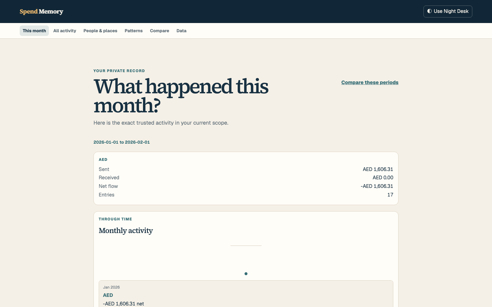

# Spend Memory

Spend Memory turns local financial statements into a private, searchable transaction history with traceable spending explanations.



This is a portfolio and learning project, not a production financial service. It has no accounts, cloud storage, bank connections, payments, analytics trackers, or remote model calls.

## Run locally with Docker

Docker Desktop is the supported way to run Spend Memory. Start Docker Desktop,
then confirm the Docker client and Compose plugin are available:

```sh
docker --version
docker compose version
```

From the repository root, start the local API and web app:

```sh
docker compose up --build -d
docker compose ps
```

Open [http://127.0.0.1:3000](http://127.0.0.1:3000). Both services bind only
to this computer. `docker compose down` stops them and keeps their local data
for the next run.

Node, pnpm, and uv are only needed for source development and checks. They are
not Docker user prerequisites.

## Try the synthetic demo

The checked-in demo is invented. It includes known merchants, categories,
recurring payments, a possible duplicate, and review examples. On the first
screen, choose **Explore the synthetic demo**.

To reset a demo workspace, first make sure it contains no personal statement.
Choose **Data**, then **Delete local data**, type `DELETE LOCAL DATA`, and
start the synthetic demo again from the first screen. This permanently clears
the local workspace. The demo action itself refuses to replace a workspace
with a real import.

`docker compose down --volumes --remove-orphans` and `make clean-demo` also
permanently remove the Docker volume. They remove personal statements too, if
you imported any.

## Import your own statement

Open [http://127.0.0.1:3000](http://127.0.0.1:3000) and choose **Import a
statement**. Select a supported local CSV or PDF, review its preview, then
choose **Import selected statement**. The app reads the file from your device
and stores it locally. It does not send it to a hosted service.

If the synthetic demo is active, the browser asks you to clear its workspace
before it makes personal import available. Clear the demo before importing a
personal statement.

## What it does

- Imports supported local CSV and PDF statements through isolated parser workers.
- Preserves raw source rows, then exposes only reconciled transactions for totals and analysis.
- Resolves merchant aliases, finds recurring payments, and surfaces possible duplicates or unusual spend for review.
- Searches descriptions and structured fields, including accounts, categories, counterparties, date ranges, amounts, currencies, and review state.
- Lets a person group trusted transactions under a private local counterparty label and see sent, received, and net flow by currency.
- Explains a spending change with the exact transactions that contributed to it.

## Supported inputs and limits

The repository includes one canonical CSV layout and two synthetic PDF layouts. The PDF parsers demonstrate the extension boundary, not universal bank support. Receipt images and transaction screenshots are experimental and disabled by default.

All real statement data stays on the device. This project does not support Windows, multi-user access, remote access, currency conversion, or cross-currency totals. See [adding a parser](docs/adding-a-parser.md) for the safe extension path.

## Architecture

```mermaid
flowchart LR
  statement["Local CSV or PDF"] --> ingress["Safe import ingress"]
  ingress --> worker["Isolated parser or OCR worker"]
  worker --> raw["Raw rows and source files\nlocal DuckDB"]
  raw --> dbt["dbt reconciliation models"]
  dbt --> trusted["Trusted transaction mart"]
  trusted --> enrich["Local enrichment and deterministic analysis"]
  enrich --> api["FastAPI on 127.0.0.1"]
  api --> web["Next.js personal record"]
```



The [architecture guide](docs/architecture.md) explains these boundaries and the local refresh flow. The [data model](docs/data-model.md) explains what is immutable, what is an annotation, and why source lineage is retained.

## Data pipeline and reasoning rules

1. Validate an untrusted file, select a parser in a spawned worker, and store source-faithful rows.
2. Use dbt to normalize amounts and directions, reconcile the import, and build trusted analytics marts.
3. Run local enrichment only after reconciliation. Merchant, category, counterparty, recurring, and review information remains separate from financial facts.
4. Query the trusted mart through the local API and show every aggregate with transaction and source evidence.

Money is always deterministic. Amounts are signed integer minor units in storage and are never calculated by ML or floating point. Heuristics handle ambiguity such as merchant aliases and recurring patterns, but they only make suggestions or annotations that a person can review.

## Methods and baselines

Merchant matching uses normalized aliases, text similarity, and local confirmed corrections. Its held-out evaluation compares that approach with exact alias matching. Search uses a local lexical baseline with structured filters. There is no hosted inference, downloaded model, semantic index, or external merchant lookup.

Recurring and duplicate detection use transparent date, amount, account, currency, and direction rules. They produce candidates, not changed transactions or altered totals.

## Evaluation

The reproducible [evaluation report](evaluations/artifacts/REPORT.md) uses only the immutable 864-row synthetic ledger.

| Measure | Result |
| --- | ---: |
| Extraction field precision and recall | 100% / 100% |
| Exact amount accuracy and reconciliation rate | 100% / 100% |
| Held-out merchant precision, recall, coverage | 100% / 100% / 100% |
| Recurring precision and recall | 100% / 100% |
| Duplicate precision at review threshold | 100% |
| Search Recall@5, MRR, filter correctness | 100% / 100% / 100% |

The recorded local benchmark ran on an Apple M2 MacBook Air with 16 GB RAM and macOS 15.6. It imported the 864 synthetic transactions in 2063.13 ms and ran the fixed 50-query search suite in 0.59 ms. These are local measurements, not production performance claims. Regenerate the report with:

```sh
PYTHONPATH=apps/api:. uv run python -m evaluations.generate --output evaluations/artifacts
```

## Privacy model

Original files, raw rows, trusted data, and corrections remain in the local
Docker volume by default. The volume contains the configured local data
directory and DuckDB file. For source development outside Docker, the default
paths are `data/` for documents and `spend-memory.duckdb` for the database.
Set `SPEND_MEMORY_DATA_DIRECTORY` and `DUCKDB_PATH` to use other local paths.
The browser keeps only small interface preferences. Parser and OCR workers have
input checks and resource limits. State-changing browser requests must
originate from the local web app.

Read [privacy.md](docs/privacy.md) and the [threat model](docs/threat-model.md) for the protections and their limits. A future hosted demo must use synthetic data and disable imports in both its interface and API. Do not commit real statements, exports, screenshots, or logs.

## Repository structure

```text
apps/api/        FastAPI routes, local services, parser workers, and tests
apps/web/        Next.js interface, component tests, and Playwright workflows
analytics/       dbt reconciliation and trusted analytics models
evaluations/     reproducible synthetic quality and runtime reports
sample_data/     deterministic synthetic statements and expected ledger
docs/            architecture, privacy, threat model, and extension guides
```

## Development checks

```sh
make lint
make test
pnpm --dir apps/web build
make e2e
```

`make e2e` uses synthetic fixtures only. The GitHub workflow also builds the Docker Compose stack and checks its loopback endpoints.

## Add a parser

New statement formats must be local, picklable parser implementations with a stable ID and version, source-faithful output, synthetic conformance data, and registry registration. They must not calculate money, write to storage directly, or silently correct a source row.

Follow the complete [parser guide](docs/adding-a-parser.md).
