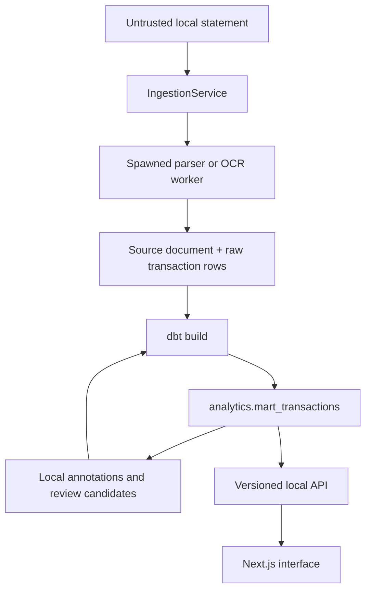

# Architecture

Spend Memory is a local monorepo. A Next.js web app talks only to a FastAPI service on the same device. The API stores data in DuckDB and a local document directory. No financial data is sent to a cloud service.

## Import boundary

`IngestionService.import_document` is the only production entry point for statement bytes. It validates the file before parser selection. Parser selection and extraction run in spawned workers with time, file-descriptor, transaction-count, and platform-appropriate memory limits. The repository receives typed source-faithful rows only after that boundary succeeds.

An exact retry is idempotent through the document SHA-256 and parser identity. A parser version change is intentionally a new import run. Imports, raw rows, and source locations are immutable.

## Trusted-data boundary

dbt derives canonical amounts, directions, reconciliation controls, and analytics marts. Product totals, search, lenses, comparisons, and charts read `analytics.mart_transactions`, never an unreconciled raw import. A failed refresh does not expose partial trusted data.

## Enrichment boundary

Confirmed merchant aliases, category assignments, and counterparties are local annotations. Recurring payments, possible duplicates, and unusual spend are review candidates. None of these changes a raw source value, a canonical amount, or a financial total.

Recurring candidates use immutable generations. Membership is validated before a single active-generation pointer changes, so a failed refresh keeps the previous local evidence available.

## API and interface boundary

The API is versioned under `/api/v1`, binds to `127.0.0.1`, uses strict request and response contracts, and returns safe error envelopes. An in-process request lock and a filesystem lock serialize DuckDB access across local work. Browser-originated mutations must come from the local web app.

The web app keeps route state in the URL and only harmless preferences in browser storage. It displays formatted money but performs no monetary arithmetic. Every aggregate links back to included transactions and their source location.

## Why this shape

The design separates facts from interpretations. It makes imports auditable, lets people correct ambiguous names without rewriting statements, and keeps exact calculations deterministic. The extra boundaries also make it practical to add a statement format without changing storage, analytics, or the interface contract.
