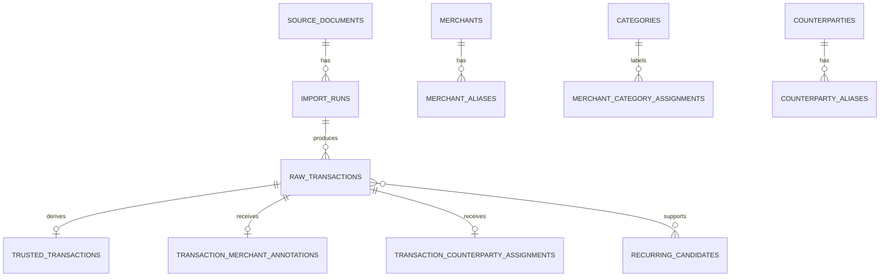

# Data model

Spend Memory keeps financial facts, derived trusted data, and user annotations separate.

## Immutable import facts

- `source_documents` records the original filename metadata, content hash, storage filename, and synthetic-demo marker.
- `import_runs` records the parser ID and version used for one document processing run.
- `raw_transactions` preserves source text, source page or row, extraction method, confidence, account identity, and optional normalized amount text.

The original document and raw row are never changed to fit a model or user correction. Exact retries reuse stored work only when the source hash and parser identity match.

## Trusted analytics

dbt reads the active raw import runs and creates `analytics.mart_transactions`. This is the sole product-facing transaction relation. It contains canonical date, currency, non-negative integer `amount_minor`, debit or credit direction, source identity, and reconciled status.

Amounts are not mixed across currencies. A net amount is derived deterministically from amount and direction. The browser formats it but does not calculate it.

## Local annotations

- `merchants` and `merchant_aliases` map local confirmed names to normalized descriptors.
- `categories`, merchant category assignments, and transaction category overrides label activity without changing a transaction.
- `counterparties`, aliases, and transaction assignments create private local groups for people or accounts.
- Transaction merchant annotations preserve confirmed and suggested resolution evidence.

These tables reference raw transaction IDs so a correction has clear source lineage. A trusted-row check prevents an annotation from attaching to unreconciled data.

## Review evidence

Recurring candidates store a generation, cadence, date window, amount range, confidence, and raw-transaction memberships. Duplicate and unusual-spend candidates store the candidate evidence separately. They are signals for review, not financial facts.

## Lifecycle

1. A local statement becomes a source document and one import run.
2. The parser emits raw rows with source evidence.
3. dbt reconciles and derives trusted rows.
4. Local enrichment adds annotations and candidates.
5. The interface reads trusted data plus annotations. It can always show the raw source evidence behind a result.

Deleting local application data removes the configured local document directory and DuckDB file after an exact confirmation and path-safety checks. It cannot delete copies exported or copied outside the application.
