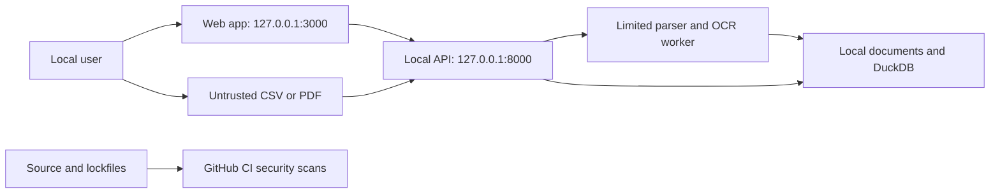

# Threat Model

Date: 2026-08-10
Owner: Maintainer
Scope: The locally running web application, API, statement-import pipeline, local data store, and repository CI.

## Assets

- Original statement files and raw transaction descriptions
- DuckDB data, corrections, and trusted analytics
- Local data deletion control
- Repository source, dependency lockfiles, and CI credentials

## Data flow and trust boundaries

The browser-to-API boundary accepts only approved local browser origins for state-changing requests. The import boundary treats every statement as untrusted. The CI boundary receives committed source and lockfiles only, never local statement files.

## Assumptions and exclusions

- The operating-system account and device are trusted. Malware or another person using that account is out of scope.
- The local application is not a multi-user service. It has no remote access, accounts, or authorization model.
- A future hosted demo is out of scope unless it uses synthetic data and has uploads disabled.
- Security controls reduce risk. They do not replace disk encryption, operating-system updates, backups, or careful handling of exported files.

## Threat register

| Element | STRIDE | Threat | Impact | Likelihood | Mitigation | Status |
| --- | --- | --- | --- | --- | --- | --- |
| Browser to API | Tampering | A malicious website submits a state-changing request to the local API. | High | Medium | Reject browser-originated `POST`, `PATCH`, and `DELETE` requests unless the origin is the local web app. | Implemented and tested |
| Docker ports | Information disclosure | Another device reaches the application over the network. | High | Low | Bind published web and API ports to `127.0.0.1`; keep the default API host local. | Implemented |
| Import pipeline | Denial of service, tampering | A crafted PDF or CSV exhausts resources or causes unsafe parsing. | High | Medium | Validate MIME type, size, pages, object count, and dimensions; parse in limited worker processes with timeouts. | Implemented and tested |
| Import storage | Tampering | A filename or symlink escapes the configured local data directory. | High | Low | Reject path separators and unsafe roots; use content-addressed filenames, `0600` staged files, atomic replacement, and safe deletion checks. | Implemented and tested |
| Local data | Information disclosure | Browser caches, logs, exports, or source control expose financial details. | High | Medium | Keep data local, return safe errors, avoid sensitive normal logs, ignore data directories, use synthetic committed fixtures, and explain export and deletion limits. | Implemented and documented |
| CSV export | Tampering | A spreadsheet evaluates a transaction string as a formula. | Medium | Medium | Prefix formula-like cells before export. | Implemented and tested |
| API contracts | Information disclosure, elevation of privilege | Invalid input or unexpected failures expose implementation details. | Medium | Medium | Use strict Pydantic contracts, parameterized DuckDB queries, bounded paging, and stable error envelopes. | Implemented and tested |
| Repository and CI | Information disclosure | A secret is committed to source control. | High | Low | Scan repository history on pushes, pull requests, and a weekly schedule. Rotate any exposed secret instead of suppressing the finding. | Implemented in CI |
| Dependencies | Tampering, elevation of privilege | A known vulnerable dependency enters the project. | High | Medium | Compare pull-request dependency scans against `main`; report full scheduled scans to GitHub code scanning. | Implemented in CI |
| Model artifacts | Tampering | Untrusted executable model data is loaded locally. | High | Low | Do not download or execute model artifacts. Current enrichment uses checked-in deterministic code and local data only. | Implemented |

## Security requirements

- Keep all real financial data local and out of source control.
- Treat statement files as untrusted until safe ingress validation and isolated parsing complete.
- Do not add a remote API, permissive CORS policy, cloud storage, or hosted model without a new threat-model review.
- Preserve deterministic money calculations and source lineage.
- Fail secret scans. Review dependency findings before accepting or releasing a change.

## Verification

- API tests cover safe error envelopes, import limits, safe local deletion, CSV formula neutralization, and cross-origin mutation rejection.
- Docker Compose publishes services only on loopback addresses.
- Gitleaks scans Git history in CI with output redaction.
- OSV scanner compares pull-request dependency risk and runs a weekly full scan.
